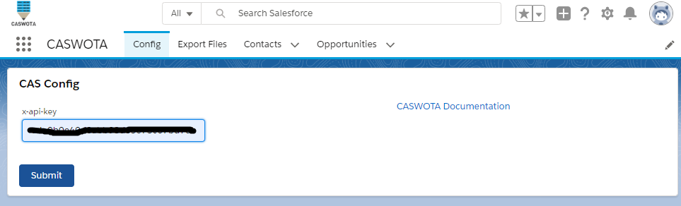
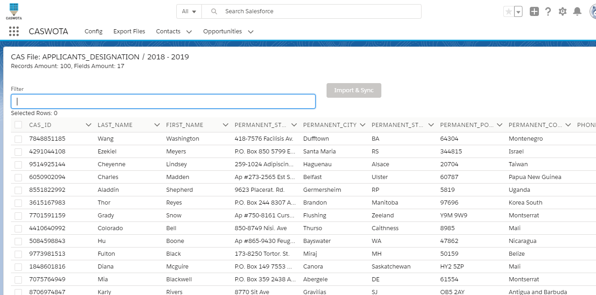
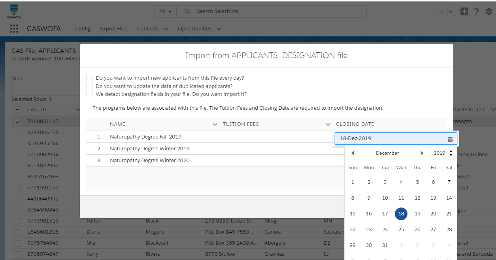

Applicants and Contact Concepts
-------------------------------

Applicants
:   A person who has applied to – and wishes to be considered for – a
    program via the centralized application service (CAS).

Accounts and Contacts
:   In Salesforce, you store information about your customers using
    accounts and contacts. Accounts are companies that you're doing
    business with, and contacts are the people who work for them.

CASWOTA vision
:   In the marketing environment we will take the Applicants as a
    Contact.

:   Note: Salesforce also has the Lead. A lead is a sales prospect who
    has expressed interest in your product or company. So, we could
    consider the lead as a person who you know but doesn't have a
    designation to any of your programs. Instead of Lead, the contact
    has selected one or more than one program.

How to import Applicants from WebAdMIT (CAS) to Salesforce?
:   
Opportunity
:   Salesforce says: "Opportunities track your sales and pending deals."

Designation
:   Many CASs allow applicants to apply to multiple programs within the
    same institution. Each application to an individual program is
    counted as a designation, so a single applicant can have multiple
    designations.

CASWOTA vision
:   In the same way, you manage the designation with the Local Status
    categories in CAS. CASWOTA allows you to convert these designations
    in Opportunity. Now, adding the Tuition Fees and Close Date.

Salesforce  | CAS   | CASWOTA
------------|-------|--------
Opportunity Name | Program Name | Applicant Last Name + Program Name\It's easy to be identified.
Amount  | --    | Tuition Fees\*\This allows to you tracking the revenew and estimate the future cash flow.
Close Date  | Cycle Timeframes\*|Closing Date\ As the WebAdMIT API doens't provide the Cycle Timeframes last date, you must enter it.
Opportunity Status  | Local Status  |   CAS Application Status\Once it's setup in Salesforce. CASWOTA imports it from the CSV file.

#### Attention! {.alert-heading}

The **Tuition Fees** and **Closing Date** fields are required in the
import process. This are requested just in the first import and
automatically save for the remaining imports.

The **CAS Application Status** and the **Program Name** fields are
pulling throught the API.

* * * * *

#### Tips! {.alert-heading}

Add to the Exported File only the required fields. See: [Local Status
Best
Practices](https://help.liaisonedu.com/WebAdMIT_Help_Center/Documents_and_Reference_Guides/Local_Statuses_Best_Practices)

* * * * *

WebAdMIT
--------

Generate an API key
:   Generate an API key. This key can be obtained from
    [WebAdMIT](https://help.liaisonedu.com/WebAdMIT_Help_Center/Application_Programming_Interface/02_Getting_Started_with_the_WebAdMIT_API#Using_the_WebAdMIT_API_for_Automation-12775).

    1.  Click Account, then Edit My Account.
    2.  Click Generate New Key.

Preparing the Export File
:   You can find all information about exporting file at CAS
    documentation: [Exporting
    Data](https://help.liaisonedu.com/WebAdMIT_Help_Center/WebAdMIT_Manual/Extracting_Data_from_WebAdMIT/Exporting_Data#Managing_Exports)

    Here we're going to learn what required fields must be included and
    the format and permissions for the export file.

**Export File Configuration**
:   The configuration file allows be reading by CASWOTA

    

Field   | Value |   Recommendation
------------|-------|--------
Access  | You must select the owner of the API key. |   CASWOTA accesses to the export file throught the API key.
File Format |   Comma-Separated Values (CSV)    |   The files with CSV is very light.
Named   |   any name    |   We recommend use a name under a conversion to be consistence. For example: you can name the file based on included data on it. E.g. APPLICANT\_DESIGNATION
Column Heading  |   with    |   CASWOTA reads the fields based on the column header.
"Many" fields will output   |   as many as you need |   The designation fields will be repeated for each applicant designation. We read all designation.

Select the Applicant fields

 

Applicant required fields
Here is the relation between the CAS and Salesforce fields.

CAS Field   | CAS Group |   Salesforce Object and Field
------------|-------|--------
CAS ID  |   Applicant   Contact.CAS\_ID. This is a custom field created by CASWOTA
First Name  |   Applicant   |   First Name
Last Name   |   Applicant   |   Last Name

Applicant recommended fields
CAS Field   |   CAS Group   |   Salesforce Object and Field
------------|-------|--------
Street Address 1	|	Permanent Mailing Address	|	Contact.Mailing Address	
Street Address 2	|	Permanent Mailing Address	|	Contact.Mailing Address	
City	|	Permanent Mailing Address	|	Contact.Mailing City	
State	|	Permanent Mailing Address	|	Contact.Mailing State	
Postal Code	|	Permanent Mailing Address	|	Contact.Mailing Postal Code	
Country	|	Permanent Mailing Address	|	Contact.Mailing Country	
Email	|	Preferred Mailing Address	|	Contact.Email

Designation required fields
CAS Field	|	CAS Group	|	Salesforce Object and Field	
------------|-------|--------
Program ID (for WebAdMIT API)	|	Designation	|	Opportunity.Name. The Opportunity name is concated from Applicant and Program Name. The Program name is taken througt the API.	|	
Local Status	|	Designation	|	Opportunity.CAS Application Status

#### Attention! {.alert-heading}

In just one Export File you can embed all required fields to import
**Contact** and **Opportunity**.

Even when the Contact is not required by Opportunity in Salesforce. We
highly recommend adding the **Contact** fields before **Opportunity**
fields.

* * * * *

#### Tips! {.alert-heading}

Create an Export File for this purpose.

video

* * * * *

CASWOTA
-------

Installation
:   As a Managed Package, CASWOTA can be accessed base on the permission
    policy of your organization. The Salesforce Administrator can
    delegate any other user and/or profile the permission to CASWOTA
    access.

    [Install Managed
    Package.](https://trailhead.salesforce.com/en/content/learn/modules/trailhead_playground_management/install-apps-and-packages-in-your-trailhead-playground)

Set Up the API key
:   The WebAdMIT API key must be copied Config Tab

    

#### Attention! {.alert-heading}

The connection with WebAdMIT will be rejected if the API key is expired
or corrupted. Check it with your WebAdMIT account manager. Every time
you enter a new API key the **User Identity**, **Export File** and
**Programs list** will be updated removing the previous data.

**Contacts** and **Opportunities** imported previously will not be
affected.

User Identity
:   Once CASWOTA is connected to WebAdMIT, it pulls the User Identity
    and all Export Files for all User Identity.

    You can select a User Identity to see the file associated to it or
    go the Export File tab

Expor Files
:   All files from all your User Identiy are listed and order by cycle.

    You can filter based on any criteria

filtering export file

Applicant List
:   The Applicant list is pulled from the selected Export File. The file
    name, cycle, amount of rows (applicants) and column are shown in the
    top left.

    The applicants are listed in the same order as the CSV file. You can
    filter by any criteria. The Import button is activated when you
    select at least an applicant to be imported.

filtering export file

Import
:   The applicants are listed in the same order as the CSV file. You can
    filter by any criteria. The Import button is activated when you
    select at least an applicant to be imported. You can select all
    applicants or some of them.

    The import screen shows three options:

    -   *Do you want to import new applicants from this file every day?*

        The selected file can be update and import every day; adding the
        new applicants and opportunities. If you don't select this
        option, the selected file will be imported just this time.

    -   *Do you want to update the data of duplicated applicants?*

        As the Export file is updated and import every day; the existing
        applicants could have changed data. This option allows for
        updating the existing Contacts.

    -   *We detect designation fields in your file. Do you want import
        it?*

        Only if the selected file has the required fields to import
        Opportunity you will see this option. As the Opportunity
        requires the Tuition Fees and Closing Date, these are requested,
        only the first time, in this step.

#### Attention! {.alert-heading}

The Applicant info listed are not saved in Salesforce until you import
them.
